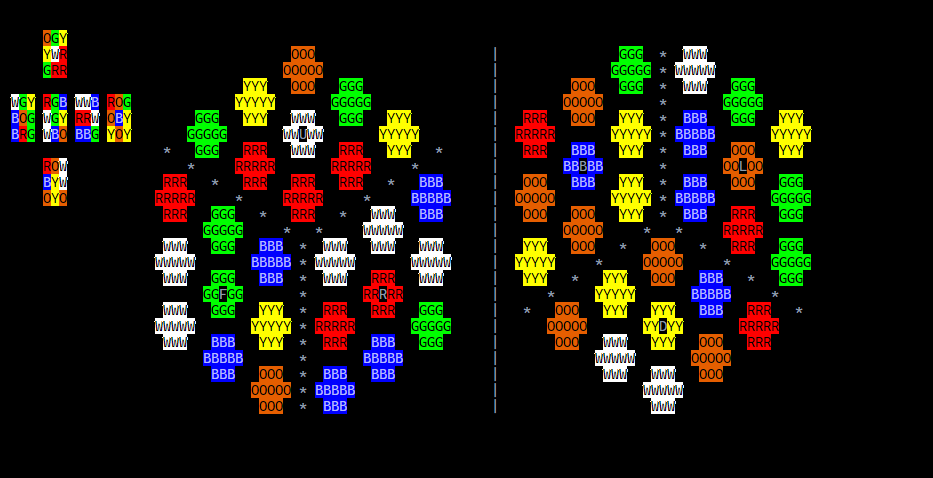
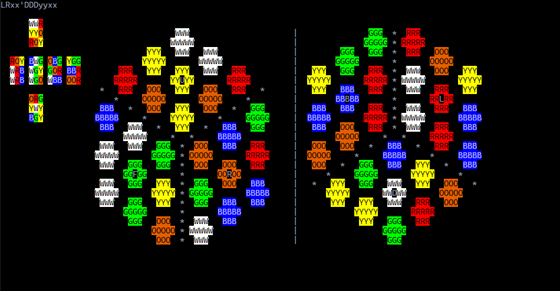
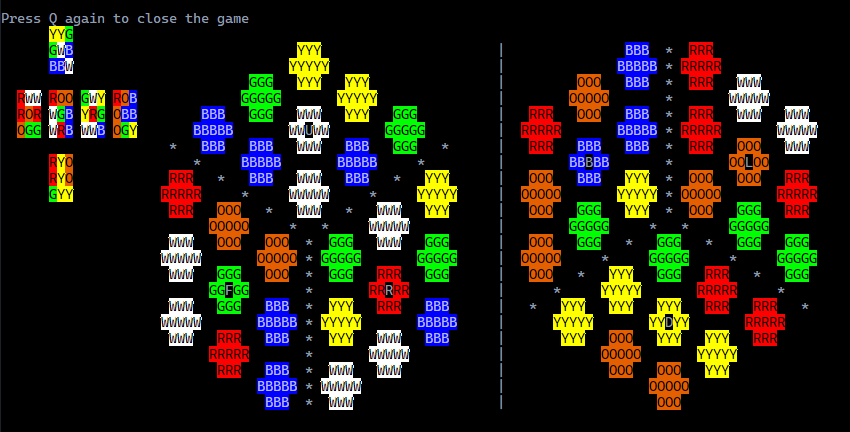
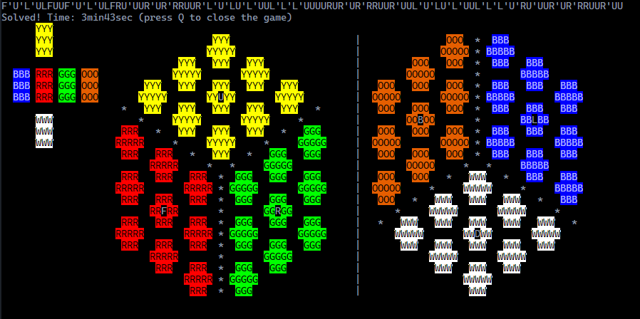

# Ncurse Cube

### 概要

３×３×３のルービックキューブを揃えるゲームを作成した。
コンパイルにはncursesライブラリが必要。

### 仕様

##### 面と回転記号

キューブの面は次に示す記号で表す。

- U：上面
- D：下面
- F：前面
- B：裏面
- R：右面
- L：左面

これらの面の回転は、面の記号を用いて表す。６面すべて同じ法則のため、F面を例に上げ て説明する。

- F ：前面を時計回りに90度回転させる
- F'：前面を反時計回りに90度回転させる
- F2：前面を180度回転させる

このように、すべての回転記号や持ち替え記号は添字がないときは基準面を時計回りに90 度、「’」がついているなら反時計回りに90度、「2」なら180度の回転を表す。

次に、発展的な回転を次の記号で定義する。

- S：FとBの間の面、回転はFと同じ方向
- M：RとLの間の面、回転はRと同じ方向
- E：UとDの間の面、回転はDと同じ方向

次に持ち替えを定義する。

- x：Fの位置にDが来るように持ち替える
- y：Fの位置にRが来るように持ち替える
- z：Rの位置にUが来るように持ち替える。

##### 初期状態

ゲーム開始とともに、RDFBRLとそれらの逆回転、180度回転をランダムに20回実行した状態で表示される。持ち替えや中間面を回転する操作は行われないので必ずFのセンターキューブは緑、Uのセンターキューブは白となっている。タイムの計測はキューブの表示と同時に開始される。

##### 操作方法

各記号と同じキーを入力することで、それに対応した回転や持ち替えを行う。 Shiftキーを押している間は、逆回転が行われる。

Qキーでゲームを終了する。

Cキーで表示されている動作のログを削除する。

##### 画面

開始直後はこのような画面が表示される。一番左はキューブの展開図、右の2つはUFRとDBLを表示している。format.txtの「a~{」と「A~[」の場所を書き換えることで、各パーツが表示される場所を変更することができる。各面のセンターキューブには、面の記号が表記されている。また、展開図と立体図の各パーツには色に応じた背景色とその頭文字が表示されている。立体図の「\*」と「|」は面の境界、「　」はパーツの境界を表している。

回転を行うと画面左上にログが表示される。このログはCキーを押すことで消去できる。ログ上では「2」の添字は表示されないため、同じ記号が連続して表示される。

キューブが揃っていない状態でQキーを一度押すと次のような警告が表示される。

キューブが完成すると、掛かった時間が表示される。この状態でQキーを一度押すとゲームが終了する。

